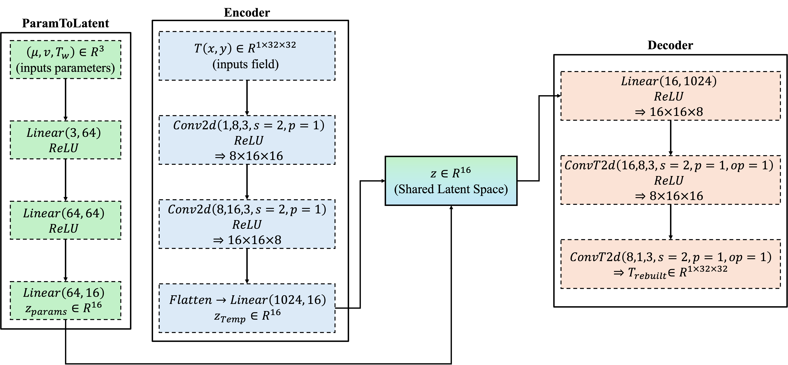
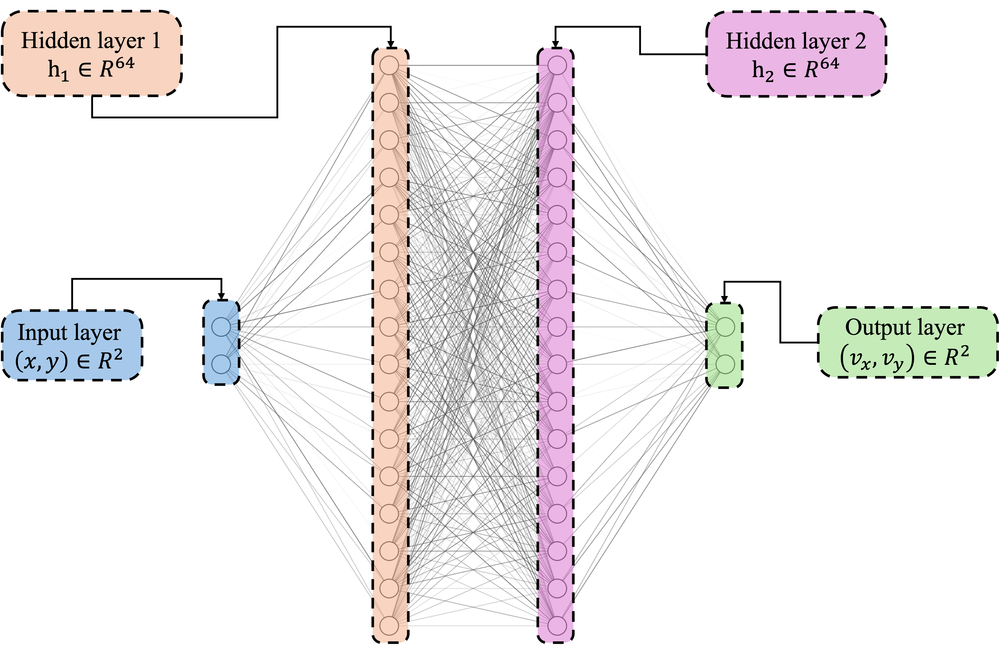

# Scientific Computing Portfolio

Selected projects in computational fluid dynamics, numerical solver development, scientific computing, and machine learning for physical systems.

I am currently an MSc student in Aerodynamics at Sorbonne University / Arts et Métiers, with a particular interest in CFD, numerical methods, high-performance computing, and AI for scientific computing.

---

## Selected Projects

### Computational Aerodynamics & Aeroelasticity — Polytechnique Montréal

Development of two complementary numerical tools during my research internship:

- a 2D compressible Euler CFD solver using finite-volume methods, JST artificial dissipation, multigrid acceleration, and OpenMP;
- an unsteady vortex-lattice method (UVLM) for aeroelastic simulations, validated against Theodorsen’s theory and applied to a 3-DOF wing–flap system.

**Topics:** CFD, finite-volume methods, multigrid, OpenMP, UVLM, aeroelasticity

[Internship report](reports/polytechnique_montreal/internship_report_aero.pdf)

---

### Incompressible Navier–Stokes Solver

Development of a 2D incompressible Navier–Stokes solver using a staggered MAC formulation and pressure projection, with transient simulations intended for subsequent reduced-order modelling.

**Topics:** CFD, finite differences, projection methods, transient flows, POD/ROM

[Technical report](reports/incompressible_navier_stokes/incompressible_ns_paper.pdf)

---

### KPZ Equation Simulation

Numerical study of the Kardar–Parisi–Zhang equation and its stochastic dynamics, with a focus on scaling behaviour and universality.

**Topics:** computational physics, stochastic PDEs, numerical simulation, universality

[Technical report](notebooks/kpz_equation/kpz_universality_numerical_study.pdf)

---

### Autoencoder Reduced Model for Forced Convection

Autoencoder-based compression of 2D temperature fields for forced-convection flows, with a latent representation conditioned on physical input parameters.

**Topics:** scientific machine learning, autoencoders, reduced-order modelling, heat transfer

[Jupyter notebook](notebooks/autoencoder_forced_convection/ai_based_reduced_model_temp_pred_2d_flow.ipynb)

---

### Neural Surrogate for NACA Flow Fields

Feedforward neural-network surrogate for predicting 2D velocity components around 4-digit NACA airfoils from spatial coordinates and geometric parameters.

**Topics:** machine learning, surrogate modelling, aerodynamics

[Jupyter notebook](notebooks/naca_flow_surrogate/approximation_of_a_flow_around_a_naca_profile.ipynb)

---

### Percolation Study

Numerical study of two-dimensional percolation and estimation of critical behaviour.

**Topics:** statistical physics, critical phenomena, numerical simulation

[Internship report](reports/percolation/internship_report_percolation.pdf)

---

> For most solver-development projects, only technical reports are provided publicly.
> Source code is kept in separate private or project-specific repositories.
> Jupyter notebooks are shared when they constitute the main project deliverable.
